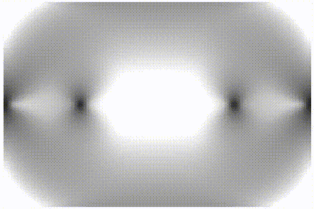
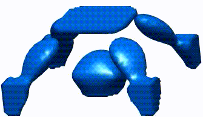

# Robust topology optimization for structures under bounded random loads and material uncertainties

This repo contains the codes for the present research by Song Bai and Zhan Kang from Dept. of Engineering Mechanics, Dalian University of Technology.

## Topology evolution animations of numerical examples

* Numerical example 1: Bridge beam

* Numerical example 2: Planar structure

* Numerical example 3: Cuboid structure

