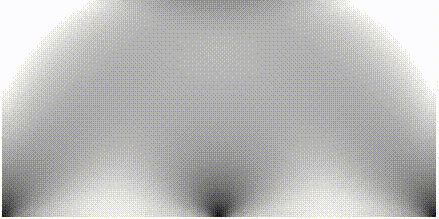

# Robust topology optimization for structures under bounded random loads and material uncertainties

This repo contains part of the codes for the present research. For the full version of the codes, please contact the corresponding author. (The MATLAB version of the Method of Moving Asymptotes (MMA) optimizer code ought to be obtained by contacting Prof. Krister Svanberg.)

## Topology evolution animations of numerical examples

* Numerical example 1: Bridge beam

* Numerical example 2: Planar structure

* Numerical example 3: Cuboid structure

